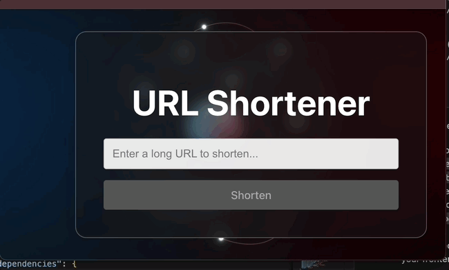

# 🚀 URL Shortener

A full-stack URL shortening service built with React, Node.js, and Azure SQL, deployed with a decoupled architecture to Vercel and Azure App Service. This project was built from scratch to showcase a wide range of software development skills.

---

### **[➡️ Live Demo Link](https://project-url-shortener-lyart.vercel.app)** 🔗

*(Note: The first request may be slow as the free-tier Azure backend "wakes up" from an idle state.)*



---

### ## 🌟 About The Project

This application allows users to shorten long URLs into a more manageable and shareable format. It serves as a comprehensive portfolio project demonstrating the end-to-end software development lifecycle, from local development with a cloud database to a fully automated CI/CD deployment on modern cloud platforms.

The primary goal was to build a reliable and scalable service while adhering to professional coding and deployment practices.

---

### ## 💻 Tech Stack

This project uses a modern, decoupled architecture:

* **Frontend:**
    * **React.js** (with Vite)
    * **Axios** for API requests
    * Hosted on **Vercel**

* **Backend:**
    * **Node.js** with **Express.js**
    * **Sequelize** ORM
    * Hosted on **Azure App Service**

* **Database:**
    * **Azure SQL Database** (Serverless Tier)

* **DevOps:**
    * **Git & GitHub** for version control
    * **GitHub Actions** for CI/CD and automated backend deployments

---

### ## ✨ Key Features

* **Shorten URLs:** Convert any valid long URL into a short, unique 7-character code.
* **URL Redirection:** Accessing a short URL automatically redirects the user to the original long URL.
* **Responsive UI:** A clean and simple user interface that works on all devices.
* **Decoupled Architecture:** A professional setup with the frontend and backend deployed and scaled independently.

---

### ## Local Setup

To run this project on your local machine:

1.  **Clone the repository:**
    ```bash
    git clone [https://github.com/fahin-p/project-url-shortener.git](https://github.com/fahin-p/project-url-shortener.git)
    cd project-url-shortener
    ```

2.  **Setup the Backend:**
    * Navigate to the server directory: `cd server`
    * Install dependencies: `npm install`
    * Create a `.env` file and add your database credentials (`DB_HOST`, `DB_USER`, `DB_PASS`, `DB_NAME`).
    * Start the server: `npm start`

3.  **Setup the Frontend:**
    * In a new terminal, navigate to the client directory: `cd client`
    * Install dependencies: `npm install`
    * Start the client: `npm run dev`
